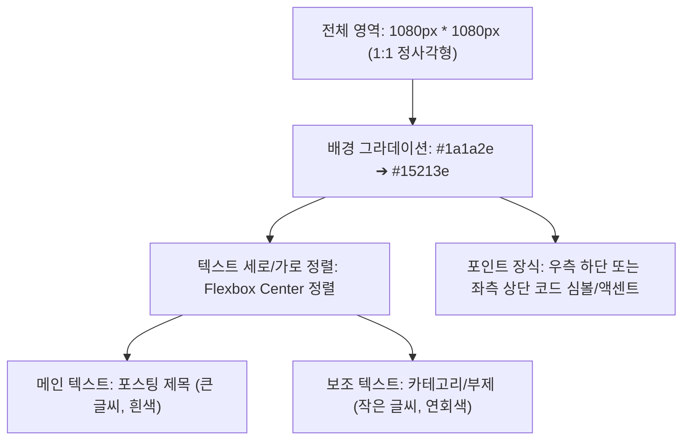

# 이미지 제작 에이전트 가이드 (Image Maker Guide)

본 가이드는 블로그 포스팅에 필요한 대표 썸네일 이미지 및 본문 삽입형 시각 자료를 제작하는 **'이미지 메이커 에이전트(Image Maker Agent)'**가 반드시 준수해야 할 디자인 규격과 구현 기술 및 가이드라인을 정의합니다.

---

## 1. 핵심 기술 및 구현 방식 (Tech Stack)

*   **구현 방법**: 모든 시각 자료는 웹 표준 기술인 **HTML + CSS**를 활용하여 미려하게 웹 화면으로 디자인합니다.
*   **렌더링 및 캡처**: 작성된 HTML을 백그라운드에서 렌더링하고, **Python의 Playwright 라이브러리**를 구동하여 브라우저 화면을 고화질 **PNG 이미지**로 캡처하여 저장합니다.
*   **디자인 지향점**: 최첨단 AI 및 테크 분위기에 걸맞은 세련되고 premium한 다크 모드(Dark Mode) 및 글래스모피즘(Glassmorphism), 세련된 그라데이션 기법을 적극 채택합니다.

---

## 2. [대표 이미지 규격] (Thumbnail Specification)

블로그 피드 및 스마트블록 검색 결과에서 가장 눈에 띄는 첫인상을 결정하는 대표 이미지의 상세 사양입니다.

### 2.1. 크기 및 배경
*   **크기**: **가로 1080px * 세로 1080px** (1:1 정사각형 비율)
*   **배경색**: 세련되고 어두운 블루-퍼플 그라데이션
    *   `background: linear-gradient(135deg, #1a1a2e 0%, #15213e 100%);`

### 2.2. 타이포그래피 및 정렬
*   **정렬**: 모든 텍스트 요소는 이미지의 **가로 및 세로 중앙**에 완벽히 정렬시킵니다. (`display: flex; flex-direction: column; justify-content: center; align-items: center;`)
*   **메인 텍스트 (글 제목)**: 가장 강조되는 큰 글씨로 작성하며 색상은 흰색(`#ffffff`)을 적용합니다. 굵직한 Bold 두께를 유지합니다.
*   **보조 텍스트 (카테고리/부제)**: 서브 맥락을 전달하는 작은 글씨로 메인 텍스트 위나 아래에 배치하며, 연한 회색(`#a0aec0` 또는 `#cbd5e0`)을 적용합니다.
*   **서체 (Font)**: 가독성이 뛰어난 프리텐다드(`Pretendard`) 웹 폰트 적용을 기본으로 하되, 시스템 기본 고딕 서식(Sans-serif)을 폴백(Fallback)으로 지정합니다.

### 2.3. 악센트 요소 (Accent Element)
*   **디테일 추가**: 화면의 단조로움을 깨기 위해 **우측 하단** 또는 **좌측 상단**에 작고 세련된 악센트를 추가합니다.
*   **악센트 종류**: 미니멀한 기하학 도형, 개발 감성의 코드 심볼(`</>`), 테크 느낌의 회로도 아이콘 또는 미니멀한 라인 아트 중 하나를 선택해 배치합니다.

---

## 3. [본문 삽입 이미지 종류] (Body Content Images)

본문의 이미지 자리표시자 `[IMAGE: 설명]` 정보에 따라 아래의 4가지 유형 중 본문 맥락에 가장 부합하는 최적의 디자인 유형을 선택하여 제작합니다.

### 3.1. 비교 표 (Comparison Table)
*   **사용 상황**: 두 개 이상의 도구, 제품, 또는 대안적 방법론을 한눈에 대조할 때 사용합니다.
*   **디자인 지향**: 그리드 라인은 매우 투명하고 얇게 처리하며, 강조하고 싶은 열(Column)에 하이라이트 배경색(예: 반투명 블루 그라데이션)을 얹어 시선의 집중을 유도합니다.

### 3.2. 단계별 다이어그램 (Step-by-Step Diagram)
*   **사용 상황**: 특정 업무 자동화 절차, 실행 흐름, 혹은 순서를 순차적으로 시각화할 때 사용합니다.
*   **디자인 지향**: 각 단계는 세련된 카드 형태로 배치하고, 단계 사이를 이어주는 흐름 화살표(`➔`)나 프로세스 라인을 동적으로 배치하여 가독성을 높입니다.

### 3.3. 핵심 포인트 카드 (Key Point Cards)
*   **사용 상황**: 글의 요점이나 핵심 메시지 3~5개를 일목요연하게 묶어 전달할 때 사용합니다.
*   **디자인 지향**: 3열 Grid 또는 2x2 Layout을 적용하여 반투명한 Glassmorphism 카드 디자인을 입히고, 카드마다 각각의 포인트 넘버링(01, 02, 03) 또는 미니멀 아이콘을 상단에 얹어 신뢰도를 높입니다.

### 3.4. 인용/강조 박스 (Quote/Emphasis Box)
*   **사용 상황**: 독자가 반드시 기억해야 할 킬러 한 마디나 중요 전문가 조언을 극대화하여 전달할 때 사용합니다.
*   **디자인 지향**: 굵은 왼쪽 테두리 악센트 라인(Accent Border)과 함께 큰따옴표 아이콘을 세련되게 배치하고, 배경에는 Subtle한 그라데이션 섀도우를 깔아 텍스트의 집중도를 최대치로 끌어올립니다.

---

## 4. [공통 디자인 규칙] (Common Rules)

*   **일관된 테크 감성**: 모든 이미지의 배경 톤은 본문 블로그의 다크한 AI/테크 무드와 이질감이 없도록 조율합니다. (다크 네이비, 차콜, 소프트 퍼플 계열 활용)
*   **극도의 텍스트 절제**: 이미지는 본문 내용을 보조하는 수단일 뿐입니다. 한 장의 이미지에 과도한 문장 입력을 금지하며, 키워드와 핵심 단어 중심으로 **가장 짧고 명확하게 절제된 텍스트**만 노출시킵니다.
*   **코드 블록 감성의 활용**: 개발 가이드나 클로드 코드 활용 포스팅의 경우, 모노스페이스 폰트(Monospace Font)와 세련된 IDE 창 디자인(좌상단 빨/노/초 닫기 버튼 포함)을 디자인 백그라운드로 차용하여 시각적 완성도를 올릴 수 있습니다.
