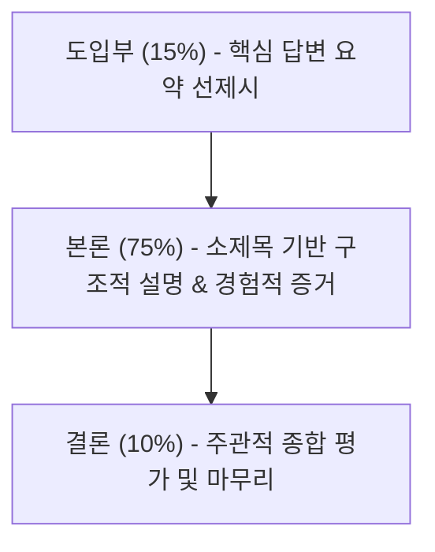

# 2026년 5월 최신 네이버 블로그 SEO 가이드 (SEO Guide)

본 가이드는 2026년 5월 네이버의 검색 알고리즘 변화(VIEW 탭 폐지, 스마트블록 및 AI 브리핑 통합 검색 고도화)를 반영한 실전 검색 엔진 최적화(SEO) 지침서입니다. 기술적인 상위 노출 꼼수에서 벗어나, 네이버가 공식적으로 지향하는 **'출처의 신뢰성(C-Rank)'**과 **'진정성 있는 사용자 경험(D.I.A.+)'**을 극대화하는 블로그 작성 규칙을 상세히 정의합니다.

---

## 1. 제목 작성 규칙 (Title Writing Rules)

네이버 검색 봇과 사용자가 가장 먼저 마주하는 핵심 요소입니다. 모바일 가독성과 스마트블록 노출을 타겟팅합니다.

### 1.1. 글자 수 가이드라인
*   **권장 크기**: **공백 포함 30자 ~ 40자 내외**가 가장 이상적입니다. (최대 45자 초과 금지)
*   **이유**: 네이버 모바일 통합 검색 화면 및 스마트블록 영역에서 제목이 잘리지 않고 끝까지 노출되는 한계선입니다.

### 1.2. 키워드 배치 전략
*   **핵심 키워드 앞 배치**: 메인 타겟 키워드는 반드시 제목의 **가장 앞부분(좌측)**에 위치시킵니다.
    *   *좋은 예*: `강남역 삼겹살 맛집 추천, 직접 다녀온 솔직 후기`
    *   *나쁜 예*: `오랜만에 친구들과 다녀온 즐거웠던 강남역 삼겹살 맛집 후기`
*   **단일 키워드 원칙**: 하나의 제목에 서로 다른 메인 키워드를 3개 이상 중복 혼합하지 않습니다. 봇이 글의 핵심 주제를 흐리게 판단합니다.

### 1.3. 피해야 할 어휘 및 기호 (스팸 필터 주의)
*   **특수문자 남발 금지**: `★`, `♥`, `[광고]`, `※` 등 눈에 띄기 위해 사용하는 특수기호는 검색 수집 로봇에 의해 스팸성 문서로 분류될 확률을 높입니다.
*   **상업적 자극 문구 배제**: `최저가`, `추천`, `1위`, `보장` 등 지나치게 광고성 냄새가 나는 단어들은 정보성 검색 노출에서 불이익을 받을 수 있습니다.
*   **무의미한 조사/어미 생략 금지**: 명사만 단답형으로 나열하는 제목보다 한국어 문맥에 맞춘 자연스러운 완성형 문장이 더 높은 평가를 받습니다.

---

## 2. 본문 구조 및 레이아웃 (Body Structure)

2026년의 네이버 검색은 사용자가 글에 머무는 **체류 시간(Duration Time)**을 매우 엄격하게 평가합니다. 이를 위해 구조적이고 읽기 쉬운 레이아웃이 요구됩니다.

### 2.1. 도입부 - 본론 - 결론 비율
가장 효과적인 이상적 분량 비율은 **15% (도입) : 75% (본론) : 10% (결론)** 입니다. (1,500자 기준)

*   **도입부 (결론 선제시)**: 서론에서 질질 끌지 않고, 검색자가 궁금해하는 핵심 정보를 **2~3문장 이내로 굵고 명확하게 선제시**합니다. 이는 네이버 AI 브리핑(Generative AI)에 인용될 확률을 극대하게 높이고, 초반 이탈률을 줄여 체류 시간을 확보합니다.
*   **본론 (정보와 경험)**: 구체적인 수치, 팩트, 나만의 팁과 더불어 직접 겪은 스토리를 서술합니다.
*   **결론 (종합 평가)**: 단순히 글을 끝맺는 것을 넘어, 주관적인 평가나 주의사항을 덧붙여 글의 독창성(DIA)을 완성합니다.

### 2.2. 소제목(Subheading)의 적극적 활용
*   **H태그 구조화**: 네이버 에디터 내의 **'인용구'** 또는 **'글머리'** 서식을 활용하여 본론을 3~4개의 소주제로 명확하게 쪼개줍니다.
*   **텍스트 배치**: 하나의 소제목 아래에는 **최대 200자~300자 내외**의 설명 글을 작성한 뒤 줄바꿈이나 이미지 삽입으로 시각적 피로도를 낮춰줍니다.

---

## 3. 키워드 밀도와 배치 (Keyword Density)

과거처럼 키워드를 무조건 많이 넣는 꼼수는 2026년 현재 완전히 차단(저품질 직행)됩니다.

### 3.1. 적정 키워드 삽입 횟수
*   **공백 제외 1,000자 기준**: **3회 ~ 5회 내외**가 가장 최적입니다.
*   **공백 제외 2,000자 기준**: **5회 ~ 7회 내외**를 넘지 않아야 합니다.

### 3.2. 자연스러운 분산 배치
*   **도입부 (1회)**: 검색 키워드를 포함한 첫 문장을 자연스럽게 작성합니다.
*   **본론 소제목 및 본문 (2~3회)**: 문맥의 흐름에 맞춰 어색하지 않게 분산합니다.
*   **결론 (1회)**: 최종 요약 과정에서 자연스럽게 키워드를 노출합니다.

> [!IMPORTANT]
> **형태소 분석기 우회하지 말 것**
> 네이버 AI는 한국어 조사와 어미 변화를 완벽하게 인지합니다. `강남역 삼겹살`을 꼭 붙여서 쓸 필요 없이 `강남역에 있는 삼겹살 매장에` 처럼 문법적으로 가장 어울리게 쓰는 것이 훨씬 안전하고 최적화에 유리합니다.

---

## 4. 이미지 및 시각 자료 규칙 (Images)

이미지는 단순 장식물이 아닌, 글의 독창성과 실제 경험을 증명하는 가장 강력한 데이터입니다.

### 4.1. 적정 이미지 개수
*   **이상적인 장수**: **5장 ~ 15장 내외** (과거의 '20장 이상 무조건 도배'는 로딩 속도를 저하시켜 오히려 마이너스 요소입니다).
*   **분야별 권장**:
    *   *IT/단순 정보성 글*: 5장 ~ 8장 내외 (필요한 캡처 화면 중심)
    *   *맛집/뷰티/여행 리뷰*: 10장 ~ 15장 내외 (직접 찍은 사진 위주)

### 4.2. 대체 텍스트(Alt Text) 대체 방법
네이버 스마트에디터 ONE은 HTML 직접 편집을 지원하지 않으므로 우회 최적화가 필수적입니다.
*   **이미지 설명 캡션 활용**: 이미지를 업로드한 후 사진 바로 하단의 **설명 입력(Caption)** 칸에 해당 사진이 무엇을 의미하는지 자연스러운 문장으로 기재합니다.
*   **주의**: 이미지 캡션마다 동일한 메인 키워드를 복사·붙여넣기 하는 것은 심각한 어뷰징 행위로 감지되므로 지양합니다.

### 4.3. 대표 이미지(Thumbnail) 규격 및 용량
*   **권장 사이즈**: 1:1 비율인 **1000px * 1000px** (최소 600px 이상)
    *   *이유*: 스마트블록 및 모바일 인기글 탭 노출 시 이미지 비율이 깨지거나 잘리지 않는 가장 안전한 규격입니다.
*   **포맷 및 용량**: 고화질 JPG 혹은 **WebP** 권장. 사진 장당 용량은 **2MB 이하**로 제한하여 페이지 로딩 로드를 최적화합니다.

---

## 5. 해시태그 최적 활용법 (Hashtags)

해시태그는 메인 검색 노출보다는 스마트블록의 서브 분류 영역 및 연관 주제 추천 점수에 관여합니다.

*   **적정 해시태그 개수**: **5개 ~ 10개**가 가장 효과적입니다. (최대 30개까지 등록은 가능하나 무의미함)
*   **태그 조합 알고리즘**:
    1.  **메인 키워드 (1~2개)**: 글의 핵심 주제 태그 (`#강남역삼겹살`)
    2.  **타겟팅 확장 서브 키워드 (3~4개)**: 검색 니즈가 확실한 세부 맥락 (`#강남역회식장소`, `#강남삼겹살맛집`)
    3.  **장소/맥락 기반 키워드 (2~3개)**: 타겟 고객층 분류 (`#강남역맛집`, `#직장인회식`)
*   **금지 사항**: 본문 내용과 단 1%의 상관도 없는 실시간 급상승 키워드나 인기 태그를 끼워 넣는 행위는 노출 누락의 결정적 원인이 됩니다.

---

## 6. 네이버 3대 검색 알고리즘 친화 패턴

2026년 현재 작동 중인 네이버의 핵심 평가 알고리즘을 만족시키는 패턴입니다.

### 6.1. C-Rank (Creator Rank: 신뢰도) 좋아하는 패턴
*   **원 토픽(One-Topic) 유지**: 맛집, IT, 뷰티, 여행 등 본인이 설정한 **하나의 전문 카테고리 글을 최소 80% 이상 비율**로 꾸준히 발행합니다.
*   **정기적 발행 주기**: 매일 쓸 필요는 없으나 주 3회~4회 등 일정한 패턴으로 신뢰할 수 있는 정보를 업로드하는 창작자에게 높은 지수를 부여합니다.

### 6.2. D.I.A. / D.I.A.+ (Deep Intent Analysis: 품질 및 경험) 좋아하는 패턴
*   **진짜 정보(Real Experience)**: 인터넷 검색을 통해 짜깁기한 뻔한 글이 아닌, **'내가 직접 결제하고, 경험하고, 겪은 사실'**이 묻어나야 합니다.
*   **사용자 피드백 지표**: 스크롤 속도, 댓글 작성 비율, 공유(스크랩) 수, 그리고 무엇보다 **사용자의 실제 체류 시간(평균 2분 이상 유지)**을 유도할 수 있도록 깊이 있는 정보를 제공해야 합니다.

### 6.3. 스마트블록 (Smart Block) 맞춤형 글쓰기
*   **명확한 세부 타겟팅**: '제주도 여행' 같은 거대 키워드 대신 '제주도 3박 4일 가족여행 코스', '비 오는 날 제주 가볼 만한 곳'처럼 **검색자의 특정 상황(Context)**에 딱 맞춰진 글이 스마트블록의 최상단에 쉽게 안착합니다.

---

## 7. 어뷰징 판정 기준 및 저품질 피하기 (Abusing)

네이버의 스팸 AI 필터인 **'리브라/바다(BADA)'**와 최신 안티 스팸 엔진에 적발되어 영구 저품질(노출 차단)에 처해지는 가장 흔한 패턴들입니다.

### 7.1. 텍스트 관련 어뷰징
*   **히든 텍스트(Hidden Text)**: 폰트 크기를 `1px`로 설정하거나 바탕색과 동일하게 만들어 키워드를 무수히 숨겨놓는 행위 (적발 시 즉시 영구 저품질).
*   **대량의 단순 복사-붙여넣기**: 외부 메모장이나 생성형 AI에서 수천 자의 텍스트를 복사한 뒤 에디터에 단 1초 만에 붙여넣어 발행하는 패턴 (수동 타이핑을 병행하거나 에디터 내에서 문장을 자연스럽게 다듬는 시간차가 필요합니다).

### 7.2. 이미지 관련 어뷰징
*   **동일 이미지 재사용**: 과거 포스팅에 썼던 사진을 메타데이터(촬영 날짜, GPS, 해상도 등) 세탁 없이 그대로 다시 업로드하여 사용하는 경우 유사 문서로 판정됩니다.
*   **무료 스톡 이미지 남발**: 픽사베이 등 유명 무료 사이트의 이미지를 주 텍스트와 상관없이 장식용으로 매 포스팅마다 반복 사용 시 상업성 도배 블로그로 지수가 하락합니다.

### 7.3. 링크 및 상업적 활동 어뷰징
*   **상업적 링크 직접 노출**: 쿠팡 파트너스, 특정 병원 링크, 불법 사설 사이트 등의 아웃바운드 링크를 본문에 직접 기재하여 다량 발행하는 경우 블로그 자체가 필터링됩니다.
    *   *우회책*: 해당 링크는 첫 번째 댓글로 안내하거나, 네이버 공식 서비스(네이버 지도, 스마트스토어 등)의 링크만을 본문에 첨부합니다.
*   **비정상적인 인위적 트래픽**: 공감/댓글 품앗이 프로그램을 돌리거나 강제로 이탈률을 조정하려는 기계적 트래픽 조작은 감지 즉시 영구 정지 처분을 받습니다.
